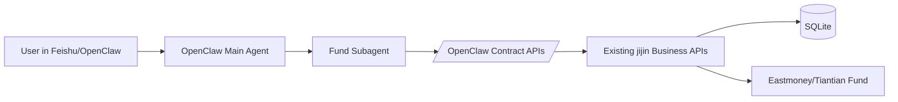

# OpenClaw 接入方案（Subagent，个人版）

## 1. 目标与范围

目标：将当前 `jijin` 项目作为 OpenClaw 的基金能力 subagent 接入，以单人自用为前提，先完成最小可用基建。

本方案覆盖：

- OpenClaw 到后端的调用边界设计。
- Phase 1 所需接口、鉴权、日志、部署和验收标准。
- 后续 Phase 2/3 的演进路径。

本方案不覆盖：

- 飞书应用配置细节。
- 多租户和复杂权限系统。
- 交易执行能力。

## 2. 现状盘点（基于当前代码）

当前后端已具备可复用能力：

- `GET /api/v1/health`
- `GET /api/v1/funds/{fund_code}`
- `GET /api/v1/funds/{fund_code}/history`
- `GET /api/v1/valuation/portfolio`
- `POST /api/v1/valuation/fund`

当前结论：

- 业务能力已可支撑基础问答（查持仓、查单基、看趋势）。
- 缺少“面向 agent 的稳定契约层”，OpenClaw 直接调业务接口会导致提示词和后端耦合。
- 缺少 subagent 专用鉴权和调用链路可观测能力。

## 3. 目标架构



说明：

- `Contract APIs` 是新增薄适配层，只做协议适配和安全控制，不复制业务逻辑。
- 业务计算继续复用现有 `services`。

## 4. Phase 1 基建（个人版最小落地）

Phase 1 目标：先让 OpenClaw subagent 在单人场景下稳定可用，避免过度工程化。

个人版优先级（服务器常驻场景）：

- 必做：`P1-API`、`P1-SEC(最小)`、`P1-OBS(最小)`、`P1-DEPLOY`
- 选做：`P1-QA(仅冒烟用例)`

### 4.1 建设项 P1-API：新增 Agent 契约接口层

新增路由分组：`/api/v1/openclaw/*`

建议接口：

1. `GET /api/v1/openclaw/health`
2. `POST /api/v1/openclaw/tools/portfolio_valuation`
3. `POST /api/v1/openclaw/tools/fund_brief`
4. `POST /api/v1/openclaw/tools/fund_history`

统一响应结构：

```json
{
  "ok": true,
  "request_id": "uuid",
  "tool": "portfolio_valuation",
  "data": {},
  "error": null,
  "meta": {
    "cost_ms": 123,
    "source": "jijin-backend"
  }
}
```

统一错误结构：

```json
{
  "ok": false,
  "request_id": "uuid",
  "tool": "fund_brief",
  "data": null,
  "error": {
    "code": "UPSTREAM_TIMEOUT",
    "message": "eastmoney request timeout"
  },
  "meta": {
    "cost_ms": 3000,
    "source": "jijin-backend"
  }
}
```

落地位置建议：

- `backend/app/api/routes/openclaw.py`
- `backend/app/schemas/openclaw.py`

### 4.2 建设项 P1-SEC：Subagent 专用鉴权（最小）

采用共享密钥（MVP 足够）：

- Header：`X-OpenClaw-Token`
- 环境变量：`OPENCLAW_TOKEN`（代码里建议命名 `openclaw_token`）
- 仅 `/api/v1/openclaw/*` 强制校验。

个人版最小安全约束：

- Token 不写日志。
- 连续失败先记普通 warning 日志，不强制接告警系统。
- 服务监听 `127.0.0.1` + 反向代理白名单访问。

落地位置建议：

- `backend/app/core/config.py` 增加配置项。
- `backend/app/api/deps.py` 或 `backend/app/core/security.py` 增加校验依赖。

### 4.3 建设项 P1-OBS：调用链路可观测（最小）

个人版最低可观测要求：

- 每次请求生成或透传 `request_id`。
- 记录 `tool_name`、`status_code`、`cost_ms`、`error_code`。
- 错误日志能区分：业务错误 / 上游超时 / 参数错误。

最小实现建议：

- 新增中间件统一注入 `request_id`。
- `openclaw` 路由统一结构化日志输出。

### 4.4 建设项 P1-DEPLOY：运行与发布基线（必做）

部署目标：保证后端在服务器上长期稳定运行（2C2G 可承载）。

必须满足以下约束：

- `uvicorn` + `systemd` 常驻。
- `restart=always`。
- 健康检查探针：`/api/v1/openclaw/health`。
- 配置 `.env`：
  - `API_V1_PREFIX`
  - `FUND_DATA_TIMEOUT_SECONDS`
  - `OPENCLAW_TOKEN`

建议部署目录：`/opt/jijin/backend`

`systemd` 单元示例（可直接改路径使用）：

```ini
[Unit]
Description=Jijin FastAPI Backend
After=network.target

[Service]
Type=simple
User=www-data
WorkingDirectory=/opt/jijin/backend
EnvironmentFile=/opt/jijin/backend/.env
ExecStart=/opt/jijin/backend/.venv/bin/python -m uvicorn app.main:app --host 127.0.0.1 --port 8000
Restart=always
RestartSec=3

[Install]
WantedBy=multi-user.target
```

上线命令（Linux）：

```bash
sudo cp /opt/jijin/backend/deploy/jijin-backend.service.example /etc/systemd/system/jijin-backend.service
sudo systemctl daemon-reload
sudo systemctl enable jijin-backend
sudo systemctl restart jijin-backend
sudo systemctl status jijin-backend --no-pager
curl http://127.0.0.1:8000/api/v1/openclaw/health
```

### 4.5 建设项 P1-QA：验收与回归（最小）

个人版建议只保留 3 条冒烟测试：

- 鉴权测试：无 token / 错 token 返回 401。
- 功能测试：`portfolio_valuation` 正常返回。
- 错误测试：上游超时时返回统一错误码。

建议文件：

- `backend/tests/test_openclaw_api.py`

## 5. Phase 1 任务拆解（个人版）

1. `P1-API` 新增 `openclaw` 路由与 schema。
2. `P1-SEC(最小)` 加入 token 配置与依赖校验。
3. `P1-OBS(最小)` 记录 request_id、tool_name、cost_ms、error_code。
4. `P1-DEPLOY(必做)` 完成 systemd 常驻和健康检查。
5. `P1-QA(最小)` 先补 3 条冒烟测试。

Definition of Done（个人版 Phase 1 完成标准）：

- OpenClaw subagent 能稳定调用至少 2 到 3 个工具接口。
- 非法调用被 token 拦截。
- 失败请求可通过 `request_id` 快速定位。
- 冒烟测试通过，且不影响现有 Web 功能。

## 6. Phase 2/3 演进（简版）

Phase 2：OpenClaw 编排接入

- 在 subagent skill 中定义工具调用规则与参数约束。
- 增加会话级缓存，减少重复请求。
- 补充飞书卡片输出模板。

Phase 3：分析能力增强

- 新增 `market_overview` 与 `portfolio_analysis` 规则化数据接口。
- 引入风险偏好参数，生成更稳定的建议文本。
- 增加定时播报能力（收盘后推送）。

## 7. 风险与回滚

主要风险：

- 上游数据源抖动导致 subagent 超时。
- 提示词变更导致调用参数漂移。
- 无契约版本控制导致兼容性问题。

控制策略：

- 契约层固定字段，业务层可迭代。
- 保留旧版本路由一段时间（如 `/openclaw/v1/*`）。
- 通过 feature flag 开关新接口。

回滚策略：

- 回滚到仅暴露 `health + portfolio_valuation` 最小集。
- 关闭新工具入口，不影响现有 Web API。

## 8. 推荐实施顺序（个人版）

1. 先做 `P1-API + P1-SEC(最小)`，让调用闭环可用。
2. 再做 `P1-OBS(最小)`，保证你自己能定位问题。
3. 最后做 `P1-DEPLOY(必做)`，再补 `P1-QA(最小)`。

按以上顺序，通常半天到 1 天可以完成个人版 Phase 1。