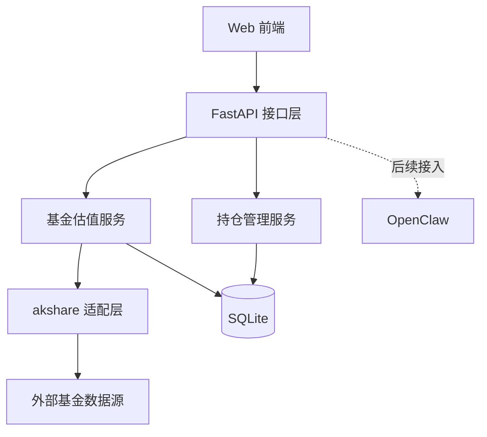
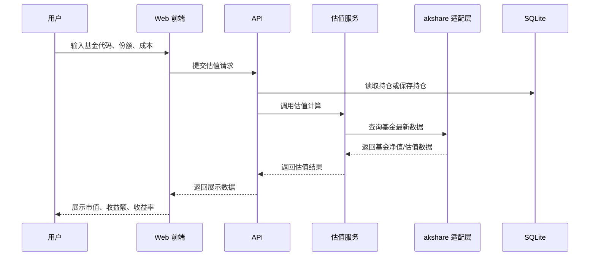

# 基金净值估算技术方案

## 1. 文档说明

本文档用于指导“基金净值估算”功能的 MVP 设计与落地实现。

本文档聚焦以下目标：

- 设计一个可独立运行的 Web MVP，用于录入基金持仓、查询基金实时数据并输出估值结果。
- 基于 `akshare` 完成基金数据获取与基础分析。
- 为后续接入 OpenClaw 预留清晰的服务边界与标准接口。

本文档不覆盖以下内容：

- 飞书接入方案。
- 多租户权限体系。
- 生产级高可用与大规模部署方案。

## 2. 背景与目标

### 2.1 背景

当前需求希望实现一个基金实时估值能力。用户提供基金代码、持仓份额、持仓成本后，系统能够结合外部金融数据源计算当前估值情况，并输出可视化结果，帮助用户快速了解单只基金与整体组合的当前表现。

数据来源初步确定为 `akshare`。MVP 阶段优先提供简单 Web 页面，后续再将能力接入 OpenClaw。

### 2.2 目标

MVP 阶段的核心目标如下：

- 支持录入和维护基金持仓信息。
- 支持按基金代码查询基金基础信息和最新估值相关数据。
- 支持计算单基金当前市值、持仓收益额、收益率。
- 支持展示组合总市值、总成本、总收益额、总收益率。
- 提供一个可直接访问的 Web 页面供用户查看估值结果。

### 2.3 非目标

以下能力不纳入 MVP：

- 自动交易。
- 多用户协作。
- 实时推送级别的数据流处理。
- 复杂投顾分析与资产配置建议。
- 飞书机器人消息编排。

## 3. 范围定义

### 3.1 MVP 范围

MVP 范围包括：

- 基金持仓录入、编辑、删除。
- 基金基础信息查询。
- 基金估值计算。
- 组合维度的汇总分析。
- 简单 Web 页面展示。
- 基础异常提示与失败重试。

### 3.2 后续扩展范围

后续阶段可扩展：

- 接入 OpenClaw 作为调用入口或能力编排层。
- 增加历史净值快照与趋势展示。
- 增加估值结果缓存和异步刷新。
- 增加用户体系、鉴权和配置中心。
- 增加更细粒度的分析能力，例如回撤、仓位分布、收益归因。

## 4. 用户场景

### 4.1 典型场景一：新增持仓并查看估值

1. 用户打开 Web 页面。
2. 用户录入基金代码、持仓份额、持仓成本。
3. 系统校验输入内容。
4. 系统调用基金数据服务获取最新数据。
5. 系统完成估值计算并展示结果。

### 4.2 典型场景二：查看组合整体表现

1. 用户进入组合总览页面。
2. 系统读取当前全部持仓。
3. 系统批量获取基金最新估值数据。
4. 系统计算组合总成本、总市值、总收益。
5. 页面展示组合汇总结果和明细列表。

## 5. 总体设计原则

- 单体优先：MVP 采用单体架构，降低开发和部署复杂度。
- 分层清晰：前端、接口、估值计算、外部数据接入、存储解耦。
- 数据可替换：外部基金数据源通过适配层封装，避免业务逻辑与 `akshare` 强耦合。
- 易扩展：后续可通过标准接口挂接 OpenClaw，不要求重写核心估值逻辑。
- 可观测：为数据获取失败、计算异常、接口超时预留日志和错误码。

## 6. 技术选型

### 6.1 后端技术栈

- 语言：Python 3.11+
- Web 框架：FastAPI
- 数据源接入：akshare
- ORM：SQLAlchemy
- 数据库存储：SQLite
- 数据校验：Pydantic
- 定时任务：APScheduler 或后续切换为独立调度任务

选择原因如下：

- `akshare` 与 Python 生态适配最好，能降低数据接入成本。
- FastAPI 对接口开发、参数校验和文档生成支持较好，适合快速构建 MVP。
- SQLite 足以支撑单用户或低并发的 MVP，本地部署成本低。

### 6.2 前端技术栈

- 框架：React
- 构建工具：Vite
- UI 方案：Ant Design 或 MUI
- 图表方案：ECharts

选择原因如下：

- React + Vite 启动快、生态成熟，适合快速搭建简单业务页面。
- 组件库可降低表单和列表页面的开发成本。

## 7. 系统架构

### 7.1 架构分层

系统采用单体分层架构，逻辑分为五层：

1. 展示层：Web 页面，负责表单录入、估值展示和交互。
2. API 层：接收前端请求，进行参数校验和请求编排。
3. 业务层：负责基金估值计算、组合汇总和分析结果生成。
4. 数据接入层：负责调用 `akshare` 获取外部金融数据。
5. 存储层：负责持仓信息、基金基础信息和估值快照的本地存储。

### 7.2 逻辑架构图



### 7.3 部署形态

MVP 阶段采用前后端分离但统一部署的方式：

- 前端打包后以静态资源形式部署。
- 后端服务提供 REST API。
- SQLite 与后端服务部署在同一运行环境中。

该方式适用于开发环境和轻量生产环境，后续如需扩展可替换为 PostgreSQL 和独立缓存组件。

## 8. 模块设计

### 8.1 前端模块

前端建议拆分为以下页面或模块：

- 首页看板：展示组合总览数据。
- 持仓管理页：录入、编辑、删除持仓。
- 基金明细页：展示单只基金估值详情。
- 刷新控制组件：手动触发估值刷新。

### 8.2 后端模块

后端建议拆分为以下模块：

- `api`：接口定义与参数校验。
- `service`：业务编排与估值计算。
- `adapters`：`akshare` 数据适配层。
- `repository`：数据库访问层。
- `models`：ORM 模型与数据结构。
- `schemas`：请求与响应结构定义。

### 8.3 核心服务职责

#### 持仓管理服务

职责如下：

- 新增、更新、删除持仓。
- 校验基金代码、份额、成本是否合法。
- 提供当前全部持仓列表。

#### 基金数据服务

职责如下：

- 封装 `akshare` 数据查询。
- 将外部原始数据转换为内部统一格式。
- 对查询超时、数据为空、字段缺失进行兜底处理。

#### 基金估值服务

职责如下：

- 对单只基金进行估值计算。
- 对组合进行汇总计算。
- 输出可直接给前端展示的结果结构。

## 9. 数据流设计

### 9.1 单基金估值流程



### 9.2 组合估值流程

1. API 层查询全部持仓。
2. 估值服务按基金代码批量拉取基金数据。
3. 逐条计算单基金结果。
4. 汇总输出组合结果。
5. 如需要，保存估值快照供后续分析使用。

## 10. 数据模型设计

### 10.1 持仓表 `positions`

| 字段 | 类型 | 说明 |
| --- | --- | --- |
| id | INTEGER | 主键 |
| fund_code | VARCHAR | 基金代码 |
| fund_name | VARCHAR | 基金名称 |
| shares | DECIMAL | 持仓份额 |
| avg_cost | DECIMAL | 持仓成本单价 |
| created_at | DATETIME | 创建时间 |
| updated_at | DATETIME | 更新时间 |

### 10.2 基金快照表 `fund_snapshots`

| 字段 | 类型 | 说明 |
| --- | --- | --- |
| id | INTEGER | 主键 |
| fund_code | VARCHAR | 基金代码 |
| nav_date | DATE | 数据日期 |
| unit_nav | DECIMAL | 单位净值 |
| estimated_nav | DECIMAL | 估算净值 |
| change_rate | DECIMAL | 涨跌幅 |
| source | VARCHAR | 数据来源 |
| created_at | DATETIME | 创建时间 |

### 10.3 组合估值结果对象

组合估值结果不强制持久化，但接口返回应统一包含以下字段：

- `total_cost`
- `total_market_value`
- `total_profit`
- `total_profit_rate`
- `items`

其中 `items` 表示每只基金的估值明细。

## 11. 估值计算规则

### 11.1 单基金估值

对单只基金，按以下公式计算：

$$当前市值 = 持仓份额 \times 当前估值单价$$

$$持仓成本 = 持仓份额 \times 持仓成本单价$$

$$收益额 = 当前市值 - 持仓成本$$

$$收益率 = \frac{收益额}{持仓成本}$$

### 11.2 组合估值

组合级指标由单基金结果汇总得出：

- 组合总成本 = 所有基金持仓成本之和。
- 组合总市值 = 所有基金当前市值之和。
- 组合总收益额 = 所有基金收益额之和。
- 组合总收益率 = 组合总收益额 / 组合总成本。

### 11.3 数据取值优先级

为了保证结果稳定性，建议约定以下优先级：

1. 优先使用当日估值数据。
2. 若无估值数据，则降级使用最近可得净值数据。
3. 若数据源异常，则返回明确错误信息，不输出误导性结果。

## 12. 接口设计

### 12.1 持仓管理接口

#### 新增持仓

- 方法：`POST /api/v1/positions`
- 请求体：

```json
{
  "fund_code": "161725",
  "shares": 1000,
  "avg_cost": 1.2356
}
```

#### 查询持仓列表

- 方法：`GET /api/v1/positions`

#### 更新持仓

- 方法：`PUT /api/v1/positions/{id}`

#### 删除持仓

- 方法：`DELETE /api/v1/positions/{id}`

### 12.2 基金查询接口

#### 查询基金基础信息

- 方法：`GET /api/v1/funds/{fund_code}`

返回示例：

```json
{
  "fund_code": "161725",
  "fund_name": "招商中证白酒指数",
  "estimated_nav": 0.9231,
  "change_rate": -0.82,
  "source": "akshare"
}
```

### 12.3 单基金估值接口

#### 直接估值

- 方法：`POST /api/v1/valuation/fund`

请求体：

```json
{
  "fund_code": "161725",
  "shares": 1000,
  "avg_cost": 1.2356
}
```

返回示例：

```json
{
  "fund_code": "161725",
  "fund_name": "招商中证白酒指数",
  "shares": 1000,
  "avg_cost": 1.2356,
  "estimated_nav": 0.9231,
  "market_value": 923.1,
  "cost_value": 1235.6,
  "profit": -312.5,
  "profit_rate": -0.2529,
  "source": "akshare"
}
```

### 12.4 组合估值接口

#### 查询组合总览

- 方法：`GET /api/v1/valuation/portfolio`

返回示例：

```json
{
  "total_cost": 5000.12,
  "total_market_value": 4820.55,
  "total_profit": -179.57,
  "total_profit_rate": -0.0359,
  "items": []
}
```

## 13. 异常处理设计

### 13.1 异常分类

- 输入异常：基金代码为空、份额非法、成本非法。
- 外部依赖异常：`akshare` 超时、接口变更、数据为空。
- 系统异常：数据库不可用、内部计算错误。

### 13.2 错误处理原则

- 所有接口返回统一错误码和错误信息。
- 外部依赖失败时，日志必须记录原始异常。
- 对于组合估值场景，单只基金失败时可标记该项失败并继续处理其他基金，避免整个页面不可用。

## 14. 缓存与性能设计

### 14.1 缓存策略

MVP 阶段可先采用内存缓存或数据库快照缓存，减少重复调用外部数据源。

建议策略如下：

- 单只基金查询结果缓存 1 到 5 分钟。
- 页面主动刷新时允许绕过缓存。
- 缓存失效后重新拉取数据并更新快照。

### 14.2 性能预估

MVP 阶段假设为低并发场景，性能瓶颈主要来自外部数据查询，而不是本地计算。

优化优先级如下：

1. 减少重复外部查询。
2. 批量获取基金数据。
3. 将数据适配和计算逻辑解耦，方便后续引入异步刷新。

## 15. 安全与合规

MVP 阶段重点关注以下内容：

- 限制输入参数，避免非法内容写入数据库。
- 本地持仓数据只保存在服务端，不暴露数据库文件。
- 记录关键操作日志，便于问题追踪。

当前阶段不涉及复杂权限体系，但接口设计应保留后续接入鉴权中间件的能力。

## 16. OpenClaw 接入预留设计

后续将该能力接入 OpenClaw 时，建议采用“能力服务 + 标准接口”的方式，而不是将估值逻辑直接写入调用端。

### 16.1 预留原则

- 核心估值逻辑继续留在本系统内部。
- OpenClaw 通过标准 HTTP API 调用估值能力。
- 请求和响应结构保持稳定、清晰、可扩展。

### 16.2 推荐接入方式

后续可将以下能力暴露给 OpenClaw：

- 查询指定基金实时估值。
- 查询当前组合总览。
- 刷新基金最新估值。

### 16.3 契约约束

为降低后续接入成本，MVP 阶段就应遵循以下约束：

- API 返回统一 JSON 结构。
- 错误码语义清晰。
- 数据字段命名稳定。
- 接口版本化，例如 `/api/v1`。

## 17. 实施计划

### 17.1 第一阶段：基础框架搭建

目标：建立前后端骨架和本地可运行环境。

交付内容：

- 后端 FastAPI 基础工程。
- 前端 React 基础工程。
- SQLite 数据库初始化。
- `akshare` 联通性验证。

### 17.2 第二阶段：核心估值能力实现

目标：打通持仓、数据查询和估值结果输出。

交付内容：

- 持仓管理接口。
- 基金查询接口。
- 单基金估值接口。
- 组合估值接口。

### 17.3 第三阶段：Web 页面实现

目标：完成可用的前端页面。

交付内容：

- 组合总览页面。
- 持仓管理页面。
- 刷新与错误提示交互。

### 17.4 第四阶段：质量与部署准备

目标：提升可测试性和可运行性。

交付内容：

- 单元测试与接口测试。
- 日志与错误码梳理。
- 基础部署文档。
- Docker 化准备。

## 18. 测试方案

### 18.1 单元测试

覆盖重点：

- 估值计算公式正确性。
- 输入校验逻辑。
- 数据适配格式转换。

### 18.2 接口测试

覆盖重点：

- 持仓 CRUD。
- 单基金估值接口返回结构。
- 组合估值接口汇总结果。
- 异常输入和外部依赖失败场景。

### 18.3 联调测试

覆盖重点：

- 前后端联调。
- 多只基金组合场景。
- 页面手动刷新与缓存绕过逻辑。

## 19. 风险与应对

### 19.1 外部数据源稳定性风险

风险说明：`akshare` 接口可能存在波动、数据字段变化或不可用问题。

应对策略：

- 通过适配层隔离外部依赖。
- 记录原始响应与错误日志。
- 为后续接入备用数据源保留替换空间。

### 19.2 估值准确性风险

风险说明：基金估值数据与最终官方净值存在时间差，可能导致展示结果与用户预期不完全一致。

应对策略：

- 页面明确标注数据来源与时间。
- 区分估算净值和正式净值。
- 在接口中返回数据时间戳和来源字段。

### 19.3 本地存储扩展性风险

风险说明：SQLite 适合 MVP，但不适合更高并发或多实例部署。

应对策略：

- 仓储层与数据库实现解耦。
- 后续平滑切换到 PostgreSQL。

## 20. 结论

本方案采用“Web MVP 先落地，能力服务后接入 OpenClaw”的实施路径，重点在于用最小复杂度尽快打通基金持仓录入、基金数据获取与估值结果展示的完整闭环。

从实现角度看，Python + FastAPI + akshare + SQLite + React 足以支撑首版交付；从演进角度看，通过适配层、标准接口和版本化设计，后续接入 OpenClaw 时无需重写核心业务逻辑。

该方案适合作为当前阶段的正式技术设计基线，后续在进入开发阶段前，可继续补充更细的接口字段说明、数据库迁移方案和部署细节。